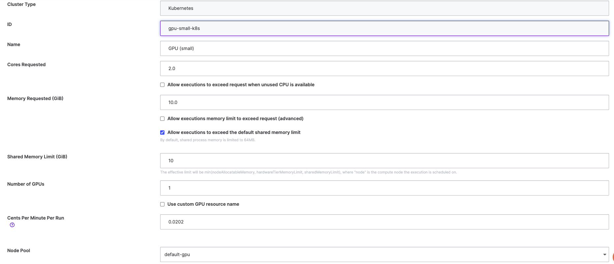

# Reference Computer Vision Model Comparison on Domino

This repository demonstrates how to benchmark multiple YOLO models (in ONNX format) using **Domino Data Lab's Experiment Manager (MLflow)**. It showcases Domino’s ability to:

- Register models into the Model Registry
- Compare model performance with standardized datasets
- Log all metrics and artifacts in a reproducible, parent-child run structure

---

## Objective

Evaluate and compare different YOLO object detection models under consistent conditions using a fixed subset of COCO images. The benchmark logs include:

- Accuracy metrics (e.g., mAP, AP50, Recall)
- Inference latency statistics
- Full evaluation artifacts and configurations

---

## Key Files

### `utilities.py`  
*Model Loading & MLflow Setup Utilities*

- Ensures MLflow experiments are created and active
- Loads registered ONNX models into Ultralytics YOLO
- Downloads model artifacts into `/tmp` for reproducibility

### `download_models_and_dataset.ipynb`  
*Preparation Script*

- Downloads COCO val2017 dataset
- Downloads pretrained YOLO ONNX models
- Stores everything under the Domino dataset mount path
- Sets up a directory structure for evaluation

### `evaluate_models.ipynb`  
*Benchmarking Script*

- Starts a **parent MLflow run**
- Evaluates each YOLO model by calling `evaluate_model()`
- Each model evaluation is logged as a **child run**
- Stores latency, accuracy, and artifacts for analysis

---

## Workflow Summary

### 1. Prepare Models and Dataset
Downloads:
- COCO val2017 validation set
- Multiple YOLO ONNX models (e.g., `yolov8n`, `yolov5n`)

Stored under:  
`/mnt/datasets/<project_name>/models` and `coco/images/val2017`

---

### 2. Evaluate Each Model

Each run:
- Loads the model from MLflow registry
- Evaluates on a consistent image subset (with seed)
- Records:
  - `mAP`, `AP50`, `Recall`, etc.
  - Inference latency distribution
  - Subset configuration
  
- Logs artifacts (e.g., latency plots, config, results)

Uses the function:
```python
evaluate_model(base_path=..., registry_model_name=..., parent_run_id=...)
```

### 3. Log Results to MLflow

- Parent run groups the comparison

- Each model evaluation becomes a child run

- All metrics and files are browsable in Domino’s MLflow UI


## Folder structure

```
reference-cv-model-comparison/
├── download_models_and_dataset.ipynb     # Downloads models + COCO data
├── evaluate_models.ipynb                 # Runs and logs benchmarking
├── utilities.py                          # MLflow helpers + model loading

/mnt/data/reference-cv-model-comparison/
├── models/                               # Downloaded model files (ONNX)
└── coco/
    ├── images/val2017/                   # COCO validation images
    └── artifacts/                        # Metrics, plots, configs
```

## Purpose of this repo

How to use Domino Experiment Manager to:

- Organize and visualize benchmarking results
- For end-to-end ML observability

## Dependiences

- ultralytics
- onnxruntime
- mlflow
- matplotlib
- PyYAML
- Domino environment with GPU access (CUDAExecutionProvider)
- Domino HW Tier with shared memory configured grow upto 10GB

## Domino Environment

**Base image**  
`quay.io/domino/pre-release-environments:project-hub-gpu.main.latest`

**Dockerfile instructions** 

```Dockerfile
RUN pip install torch==2.3.1+cu121 torchvision==0.18.1+cu121 -f https://download.pytorch.org/whl/torch_stable.html
RUN pip install ultralytics
RUN pip uninstall -y opencv-python opencv-contrib-python opencv-python-headless
RUN pip install onnxruntime-gpu
RUN pip install onnxruntime
RUN pip install pycocotools
RUN pip install --upgrade onnxruntime-gpu==1.18.0 
RUN sudo apt-get update
RUN sudo apt-get install -y libgl1
```

**Pluggable workspace tools**
```
jupyterlab:
  title: "JupyterLab"
  iconUrl: "/assets/images/workspace-logos/jupyterlab.svg"
  start: [ "/opt/domino/workspaces/jupyterlab/start" ]
  httpProxy:
    internalPath: "/{{ownerUsername}}/{{projectName}}/{{sessionPathComponent}}/{{runId}}/{{#if pathToOpen}}tree/{{pathToOpen}}{{/if}}"
    port: 8888
    rewrite: false
    requireSubdomain: false
vscode:
 title: "vscode"
 iconUrl: "/assets/images/workspace-logos/vscode.svg"
 start: [ "/opt/domino/workspaces/vscode/start" ]
 httpProxy:
    port: 8888
    requireSubdomain: false
```

## Hardware Tier

Use a GPU enabled hardware tier although CPU enabled works as well (with performance penalty). If using a GPU
based hardware tier ensure you use a shared memory of size greater than 10 GB.




## Getting Started

1. Run `download_models_and_dataset.ipynb` to set up the base folder.

2. Run `evaluate_models.ipynb` to benchmark and log comparisons.

3. Explore results in the Domino Experiment Manager (MLflow).


## Notes

- Uses deterministic seed to ensure reproducible benchmarking

- Uses /tmp for model loading to avoid cluttering user space

- Registered model format expected: ONNX

## Example Output

- Logged artifacts per model include:

  - `headline.json` with all metrics

  - `latency.json` with percentile stats

  - `latency_hist.png` for visual latency distribution

  - Full Ultralytics evaluation folder